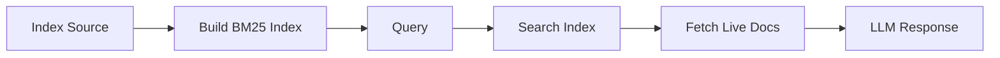

<p align="center">
  
</p>

<h1 align="center">docr-mcp</h1>

<p align="center">
  <strong>A framework for building MCP servers that give LLMs access to any documentation.</strong>
</p>

<p align="center">
  Give LLMs the ability to search and read documentation from any source - public or private, official or internal. Stop getting outdated answers. Start getting accurate information directly from current docs.
</p>

<p align="center">
  <a href="https://pypi.org/project/docr-mcp/"></a>
  <a href="https://github.com/JacobHuang91/docr-mcp/actions"></a>
  <a href="https://www.python.org/downloads/"></a>
  <a href="https://opensource.org/licenses/MIT"></a>
</p>

## Why docr-mcp?

**The Problem**: LLMs give you outdated answers based on their training data. They don't know about the latest API changes, new features, or the specific libraries and tools you use daily.

**The Solution**: docr-mcp provides a proven framework to connect any documentation to LLMs through MCP servers. Give your AI assistant real-time access to current documentation - from popular libraries to your internal tools.

**Key Features**:
- **Universal framework** for any documentation site (public or private)
- **Smart BM25 search** with code-aware tokenization and relevance ranking
- **Full customization** - control parsing, indexing, search, and tool descriptions
- **Production ready** - 88 tests (unit + E2E), secure by default, proper resource management
- **Easy to extend** - YAML config + Python implementation to add any library

## Supported Documentation

| Library                                      | Status | Tests | Install Command (Claude Code)                                              |
| -------------------------------------------- | ------ | ----- | -------------------------------------------------------------------------- |
| [Strands Agents](https://strandsagents.com) | ✅     |  | `claude mcp add docr-mcp-strands -- uvx docr-mcp --library strands`       |
| [Vercel](https://vercel.com)                 | ✅     |  | `claude mcp add docr-mcp-vercel -- uvx docr-mcp --library vercel`         |
| [Twilio](https://twilio.com)                 | ✅     |  | `claude mcp add docr-mcp-twilio -- uvx docr-mcp --library twilio`         |
| [OpenAI](https://openai.com)                 | ✅     |  | `claude mcp add docr-mcp-openai -- uvx docr-mcp --library openai`         |
| [Stripe](https://stripe.com)                 | ✅     |  | `claude mcp add docr-mcp-stripe -- uvx docr-mcp --library stripe`         |
| [Anthropic](https://anthropic.com)           | ✅     |  | `claude mcp add docr-mcp-anthropic -- uvx docr-mcp --library anthropic` |

**Want to add a library?** See [CONTRIBUTING.md](CONTRIBUTING.md) for guidelines.

## Usage

### Public Documentation

After installation, ask your AI assistant to search documentation:

```
Search Strands docs for "agent state"
What is agent-loop in Strands?
Show me how to use model providers in Strands
```

### Authenticated Documentation (Private/Internal Docs)

Need to access private or internal documentation behind authentication? docr-mcp supports cookie-based authentication for SSO-protected sites.

Simply create a YAML config file with your cookies and domain - no code changes required.

📖 **See the [Authenticated Docs Guide](src/docr_mcp/config/authenticated/README.md) for step-by-step instructions.**

## How It Works



1. **Startup**: Fetch index source (llms.txt, sitemap) and build searchable BM25 index
2. **Query**: Search pre-built index, then fetch live documentation from URLs
3. **Search**: BM25 ranking with code-aware tokenization and field weighting


## License

MIT
