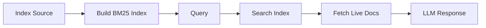

# docr-mcp

**A framework for building MCP servers that give LLMs access to any documentation.**

Give LLMs the ability to search and read documentation from any source - public or private, official or internal. Stop getting outdated answers. Start getting accurate information directly from current docs.

[](https://github.com/JacobHuang91/docr-mcp/actions)
[](https://www.python.org/downloads/)
[](https://opensource.org/licenses/MIT)

## Why docr-mcp?

**The Problem**: LLMs give you outdated answers based on their training data. They don't know about the latest API changes, new features, or the specific libraries and tools you use daily.

**The Solution**: docr-mcp provides a proven framework to connect any documentation to LLMs through MCP servers. Give your AI assistant real-time access to current documentation - from popular libraries to your internal tools.

**Key Features**:
- **Universal framework** for any documentation site (public or private)
- **Smart BM25 search** with code-aware tokenization and relevance ranking
- **Full customization** - control parsing, indexing, search, and tool descriptions
- **Production ready** - 31+ tests, secure by default, proper resource management
- **Easy to extend** - YAML config + Python implementation to add any library

## Supported Documentation

| Library                                      | Status    | Install Command (Claude Code)                                                             |
| -------------------------------------------- | --------- | ----------------------------------------------------------------------------------------- |
| [Strands Agents](https://strandsagents.com) | ✅ Active | `claude mcp add docr-mcp-strands -- uv --directory $(pwd) run docr-mcp --library strands` |

**Want to add a library?** See [CONTRIBUTING.md](CONTRIBUTING.md) for guidelines.

## Installation

```bash
# Clone the repository
git clone https://github.com/JacobHuang91/docr-mcp.git
cd docr-mcp

# Install dependencies
uv sync

# Add to your MCP client
# Example for Claude Code:
claude mcp add docr-mcp-strands -- \
  uv --directory $(pwd) run docr-mcp --library strands

# Restart your client to activate
```

## Usage

After installation, ask your AI assistant to search documentation:

```
Search Strands docs for "agent state"
What is agent-loop in Strands?
Show me how to use model providers in Strands
```

## How It Works



1. **Startup**: Fetch index source (llms.txt, sitemap) and build searchable BM25 index
2. **Query**: Search pre-built index, then fetch live documentation from URLs
3. **Search**: BM25 ranking with code-aware tokenization and field weighting


## License

MIT
